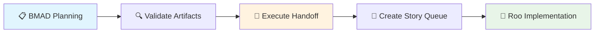

# bmad-roo-installer

Initial commit for the bmad-roo-installer project.

# BMAD + Roo Commander Installer

One-command installation for unified BMAD planning + Roo Commander implementation workflow.

## 🚀 Quick Install

### One-Line Install (Recommended)
```bash
curl -fsSL https://raw.githubusercontent.com/YOUR_USERNAME/bmad-roo-installer/main/install-bmad-roo.sh | bash
```

### Alternative Methods

#### Clone & Run
```bash
git clone https://github.com/YOUR_USERNAME/bmad-roo-installer.git
cd bmad-roo-installer
./install-bmad-roo.sh
```

#### Download Script
```bash
curl -O https://raw.githubusercontent.com/YOUR_USERNAME/bmad-roo-installer/main/install-bmad-roo.sh
chmod +x install-bmad-roo.sh
./install-bmad-roo.sh
```

## 📋 Requirements

- Git repository (run from project root)
- [pnpm](https://pnpm.io/) installed
- Node.js (for handoff automation)

### Install pnpm if needed:
```bash
npm install -g pnpm
# or
curl -fsSL https://get.pnpm.io/install.sh | sh -
```

## 🎯 What Gets Installed

- ✅ **BMAD-METHOD** - Agile documentation framework
- ✅ **Roo Commander** - Implementation agent framework  
- ✅ **Integration Bridge** - Seamless handoff automation
- ✅ **Project Structure** - Organized docs and journal folders
- ✅ **pnpm Scripts** - Easy workflow commands

## 🔄 Workflow

### 1. Planning Phase (BMAD)
```bash
# Use @bmad-orchestrator in your IDE
# Creates documentation in docs/ folder
# Generates stories in docs/stories/
```

### 2. Validation
```bash
pnpm bmad:validate  # Check if ready for handoff
```

### 3. Handoff
```bash
pnpm bmad:handoff   # Bridge planning to implementation
```

### 4. Implementation Phase (Roo Commander)
```bash
# Use @roo-commander in your IDE
# Implements stories from queue
pnpm roo:queue      # Check story status
```

## 🔧 Commands

| Command | Description |
|---------|-------------|
| `pnpm bmad:handoff` | Execute handoff from planning to implementation |
| `pnpm bmad:validate` | Check if all artifacts ready for handoff |
| `pnpm roo:queue` | Show current story queue status |
| `pnpm roo:start` | Reminder to use @roo-commander |
| `pnpm roo:next` | Get next story to implement |

## 📁 Project Structure

```
your-project/
├── .bmad-core/              # BMAD framework
├── .roo/                    # Roo Commander framework
│   └── story-queue/         # Stories ready for implementation
├── docs/                    # Planning outputs
│   ├── project-brief.md
│   ├── prd.md
│   ├── architecture.md
│   └── stories/             # Individual story files
├── project_journal/         # BMAD task logs
│   ├── tasks/
│   ├── decisions/
│   └── planning/
├── scripts/                 # Integration automation
│   └── bmad-roo-handoff.js
└── .bmad-roo-config.yaml   # Integration config
```

## 🔗 Integration Flow



## 📥 Importing Existing Docs

If you have documentation from Gemini web version:

1. **Place docs in the `docs/` folder:**
   ```
   docs/
   ├── project-brief.md
   ├── prd.md
   ├── architecture.md
   └── stories/
       ├── story-001.md
       └── story-002.md
   ```

2. **Validate completeness:**
   ```bash
   pnpm bmad:validate
   ```

3. **Execute handoff when ready:**
   ```bash
   pnpm bmad:handoff
   ```

## 🛠️ Troubleshooting

### Common Issues

**❌ "Not in a git repository"**
```bash
# Run from your project root where .git exists
cd your-project
./install-bmad-roo.sh
```

**❌ "pnpm is required but not installed"**
```bash
npm install -g pnpm
# or
curl -fsSL https://get.pnpm.io/install.sh | sh -
```

**❌ "Missing required artifacts"**
```bash
# Use BMAD to create missing docs
# Then validate again
pnpm bmad:validate
```

## 🤝 Contributing

1. Fork the repository
2. Create a feature branch
3. Make your changes
4. Test the installer
5. Submit a pull request

## 📄 License

MIT License - see [LICENSE](LICENSE) file for details.

## 🔗 Related Projects

- [BMAD-METHOD](https://github.com/bmadcode/BMAD-METHOD) - Agile documentation framework
- [Roo Commander](https://github.com/jezweb/roo-commander) - Implementation agent framework

---

**Made with ❤️ for seamless AI-assisted development workflows**